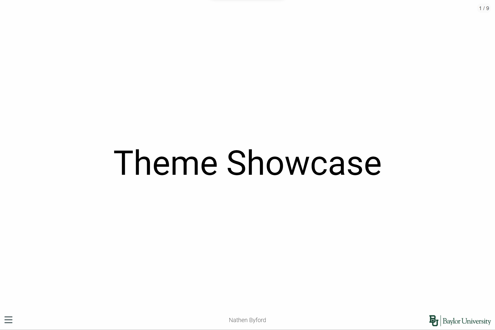
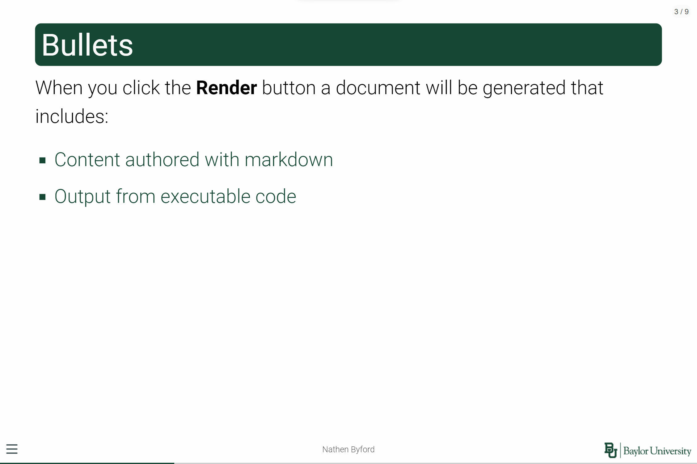

# Baylor reveal.js Theme for Quarto

This theme is heavily influenced by the [metropolis](https://github.com/pat-s/xaringan-metropolis) and [quarto-metropolis](https://codeberg.org/pat-s/quarto-metropolis) themes. With some color changes and the Baylor University logo in the corner.

## Edits made

-   Baylor green headings,
-   Baylor logo,
-   Baylor green square bullet points,
-   Gray column backgrounds,
-   Roboto font default, and
-   Jetbrains mono font (no ligatures) for code blocks.

## Photos






## Usage notes

- To use the template in for a new document use the following code in the terminal.
```
quarto use template nathenbyford/baylor-quarto-theme
```
- To use the template on a preexisting quarto document and just add the theme you can use the following code in the terminal
```
quarto add nathenbyford/baylor-quarto-theme
```

- When using columns, the overall width of the combined columns need to add up to 94% othewise they won't fit side by side. A similar issue can be found in [quarto-metropolis](https://codeberg.org/pat-s/quarto-metropolis). 
    - This issue could be solved if the grey background is removed from the columns.

